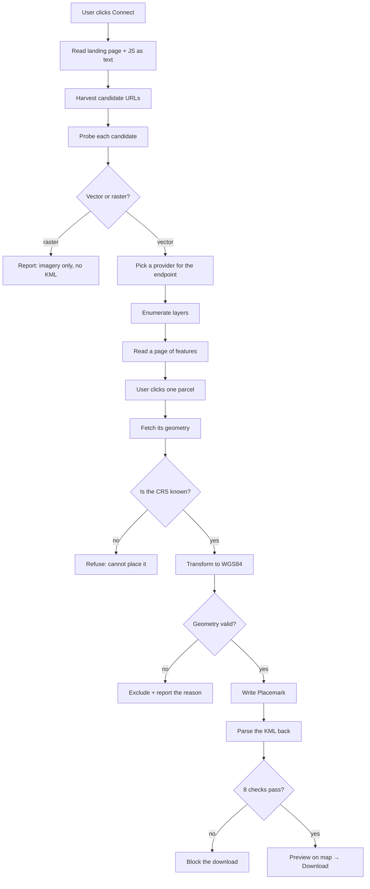
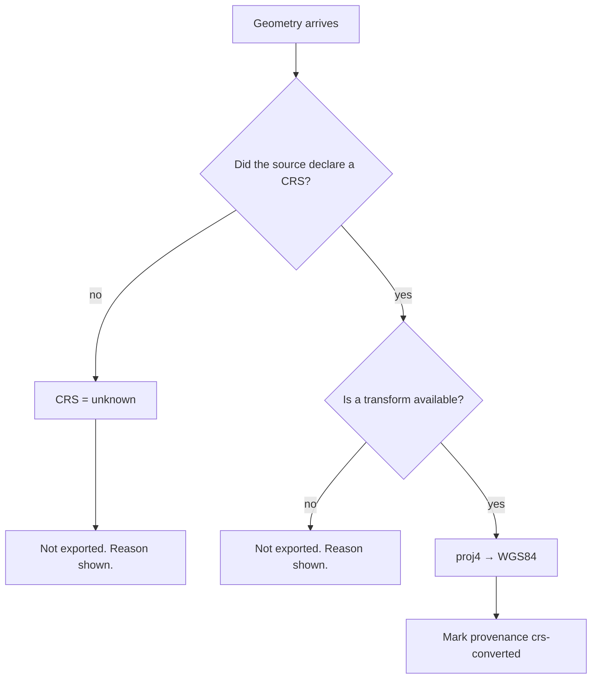
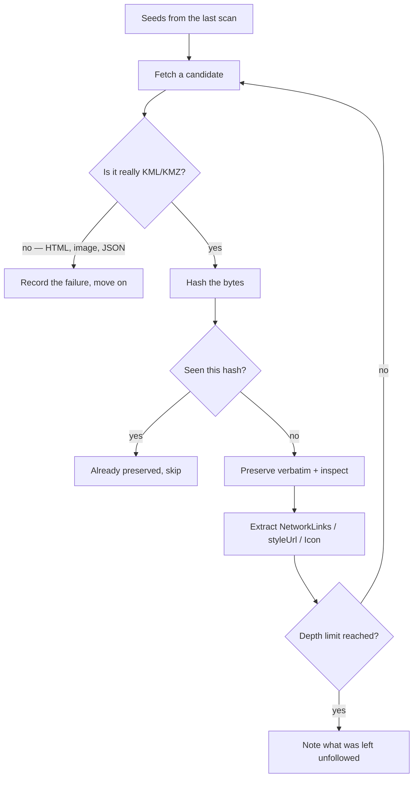
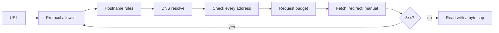

# How the TownPlanMap KML Extractor works

This document explains the *mechanism* — what happens to a land parcel between a user clicking "Connect" and a
`.kml` file landing in their downloads folder, and why each step is built the way it is.

For what the tool does and how to run it, see the [README](../README.md). For the API surface, see the same.
This is the "open the lid" document.

---

## 1. The one idea

Everything here follows from a single rule:

```
ACTUAL VECTOR GEOMETRY
        ↓  extract it
        ↓  validate it
        ↓  transform its CRS if required
        ↓  generate KML
        ↓  validate the KML
        ↓  preview it
        ↓  download
```

and, just as importantly, the thing it refuses to do:

```
map screenshot → guess a boundary → call it exact KML
```

That distinction drives the architecture. The tool spends most of its effort on two questions —
**"is this real geometry?"** and **"do I actually know where it is?"** — and it is willing to produce nothing at
all rather than answer either one with a guess.

A KML file that is silently 50 km off is worse than no file, because nobody can tell by looking.

---

## 2. One parcel, end to end

Before the detail, here is the whole journey for a single land parcel.



Three of those branches end in *nothing being produced*. That is deliberate, and it is most of what
distinguishes this tool from one that traces pictures.

---

## 3. Stage by stage

### Stage 1 — Connect: finding the data behind the map

`src/lib/discovery/engine.ts`

A modern map page keeps its data endpoints in three places, and the scan reads all three:

1. **The landing page markup** — `src`, `href`, `data-*` attributes.
2. **Inline `<script>` bodies** — where the bootstrap configuration usually lives.
3. **Bundled JavaScript** — up to `MAX_SCRIPTS` (6) external bundles.

> **Fetched JavaScript is read as text and never executed.** The tool is a parser, not a browser. This is a
> security property first (arbitrary third-party code never runs server-side) and a predictability property
> second.

The harvester (`harvest.ts`) deliberately **over-collects**: it matches any URL containing a geospatial
signal — `/rest/services/`, `service=WFS`, `.geojson`, `{z}/{x}/{y}`, cadastral words like `parcel` / `survey`
/ `khasra`, planning words like `tp_scheme` / `landuse`, and so on — then excludes the obvious noise
(analytics, fonts, stylesheets, login paths).

Candidates are then **ranked** before probing, because the request budget is finite: a FeatureServer is worth a
request before a TileJSON is, which is worth one before an unclassified JSON document.

Up to `MAX_PROBES` (24) candidates get one request each. Anything beyond that stays listed but is honestly
marked as unprobed rather than quietly dropped.

Finally the engine follows **one level** of indirection — a map style document names the sources a map draws
from; an ArcGIS services directory names the services under it. One level, deliberately: this is a targeted
expansion, not a crawl.

---

### Stage 2 — Classify: is it geometry, or a picture of geometry?

`src/lib/geo/detect.ts`

This is the decision the whole product turns on, so it is made from evidence in this order:

| Evidence | Trusted? |
|---|---|
| **Magic bytes of the response body** | Decisive |
| Structure of the body (`"type":"FeatureCollection"`, `<kml>`, `rings`, …) | Decisive |
| Declared `Content-Type` | A hint — servers get this wrong constantly |
| URL shape | A hint only, used for *ranking* before a body exists |

A probe reads at most `PROBE_BYTES` (512 KB) — enough to identify a format and read a service description,
never enough to accidentally pull a multi-megabyte dataset just to learn its type.

The verdict is one of four natures: **vector**, **raster**, **metadata** (a signpost to other resources), or
**unknown**. `unknown` is a real answer, not a synonym for vector.

```
PNG/JPEG/WebP magic bytes  →  raster  →  "Only map imagery available. KML cannot be generated reliably."
"type":"FeatureCollection" →  vector  →  eligible for export
Content-Type: image/png    →  raster
neither                    →  unknown →  reported as undetermined
```

---

### Stage 3 — Places: cities and villages, never hard-coded

`src/lib/discovery/locations.ts`

The rule is that **no place name ships with the tool**. Three independent strategies extract them from the
source, and each entry records where it came from so the UI can show its provenance:

| Strategy | Reads | Good for |
|---|---|---|
| **A. Markup** | `<select>` / `<datalist>` options, classified by the control's own name/id | Cities |
| **B. Bootstrap data** | JSON arrays reached through a place-shaped key (`cities`, `villages`, `talukas`…) | Either |
| **C. Layer attributes** | Distinct values of a place-name column on a boundary layer | Villages |

Strategy C is the most trustworthy for villages, because it reads them out of the boundary layer that actually
defines them. On ArcGIS it uses `returnDistinctValues=true`, so the server computes the distinct set and the
tool spends one cheap request instead of downloading every feature.

If all three find nothing, the selector says so. It does not fall back to a built-in list.

---

### Stage 4 — Layers: one shape for every kind of server

`src/lib/discovery/providers/`

A **provider** knows how to talk to one family of GIS service and converts it into the two records the rest of
the application understands — `LayerRecord` and `FeatureRecord`. Everything downstream of this point is
server-agnostic.

Dispatch is **first match wins, most specific first**:

```
FixtureProvider      →  the synthetic demo dataset (exact URL scheme)
ArcGisProvider       →  FeatureServer / MapServer
WfsProvider          →  OGC WFS 1.x / 2.x  (+ GML fallback)
GeoJsonFileProvider  →  GeoJSON documents
TopoJsonFileProvider →  TopoJSON topologies
KmlFileProvider      →  KML / KMZ
VectorTileProvider   →  Mapbox Vector Tiles
```

> Order matters and has already bitten once: `GeoJsonFileProvider` matches *any* endpoint of kind `geojson`,
> which shadowed the more specific fixture provider until the fixture provider was moved in front of it.

Each provider reports, per layer, whether geometry is available (`vector` / `raster` / `restricted` /
`unknown`), what CRS the service declared, which attribute fields exist, and **whether KML can be produced —
with a sentence explaining why or why not**. That sentence is carried all the way to the UI; a greyed-out
export button always has a reason attached.

---

### Stage 5 — Features: reading without drowning

List views deliberately **omit geometry** — a table needs names and attributes, and pulling every polygon to
render a list would be slow and wasteful. The map and the detail panel request it explicitly
(`?geometry=1`), and `ensureGeometry()` fetches it on demand for anything that reaches an export without it.

Reading is paged and bounded at every level:

- `featurePageSize` (default 1,000) per request
- `maxFeaturesPerLayer` (default 50,000) per layer
- `maxFeaturesPerExport` (default 100,000) per export job
- a per-operation **request budget** with concurrency and per-host throttling

When a cap stops a read, the user is told. A silently partial export is a wrong export.

Whole-document sources (GeoJSON, TopoJSON, KML) are cached in-process for `CACHE_TTL_MS` (5 minutes), so
listing a layer and then reading a feature's geometry does not download the same file twice.

---

### Stage 6 — Coordinates: the part most likely to be silently wrong

`src/lib/geo/crs.ts`, `src/lib/discovery/providers/gml.ts`

KML is defined against WGS84. Everything else has to be transformed — and this is where a tool can be
confidently, invisibly wrong.

#### 6a. Never assume



An undeclared CRS produces `unknown`, not `EPSG:4326`. The one exception is honest and labelled: GeoJSON is
*defined* by RFC 7946 to be WGS84, so a GeoJSON document with no CRS member is marked
`assumed-by-spec` — visibly different from `declared` in the inspector.

All transformation maths is delegated to **proj4**. This module's job is deciding *which* CRS applies, not
doing spherical trigonometry by hand.

#### 6b. The axis-order trap

The single most dangerous ambiguity in GIS interchange, and the reason `gml.ts` is long:

- `EPSG:4326` **defines** latitude as its first axis.
- Almost everyone used the short form `EPSG:4326` to mean *longitude* first.
- So OGC introduced `urn:ogc:def:crs:EPSG::4326` to mean the authority's real order — latitude first.

**The two spellings of "the same" CRS therefore imply opposite coordinate orders.** Reading it wrong does not
throw and does not look broken — it transposes every coordinate, and a parcel in Gujarat is written into the
Indian Ocean off Somalia.

The rules applied, in order:

| Spelling | Order | Why |
|---|---|---|
| `CRS:84`, `urn:…:OGC:1.3:CRS84` | lon, lat | That is the entire reason CRS84 exists |
| `urn:ogc:def:crs:EPSG::4326`, OGC HTTP URI | lat, lon | Authority form = authority axis order |
| `EPSG:4326` | lon, lat | Long-standing convention |
| Any projected CRS (UTM etc.) | easting, northing | Maps to x, y |

Three defences back this up:

1. GML requests ask for `urn:ogc:def:crs:OGC:1.3:CRS84`, whose order is unambiguous by definition.
2. A response declaring **no** `srsName` is treated as CRS-unknown — because *asking* for CRS84 is not the
   same as the server *confirming* it, and many servers ignore the parameter.
3. A plausibility check flags geometry that only makes sense transposed. It **reports** the suspicion; it never
   silently "corrects" the coordinates.

---

### Stage 7 — Validate the geometry

`src/lib/geo/geometry.ts`

Run *after* transformation, because a longitude/latitude range check is meaningless on metres.

| Check | Failure code |
|---|---|
| NaN / Infinity / non-numeric ordinates | `non-finite-coordinate` |
| Coordinates within ±180 / ±90 | `out-of-range` |
| Polygon rings closed | `unclosed-ring` |
| Rings have ≥ 4 positions | `insufficient-vertices` |
| Geometry is non-empty | `empty-geometry` |
| Vertex count under the limit | `too-many-vertices` |
| Type is supported | `unsupported-type` |

There is exactly **one** correction the tool will make: closing a polygon ring whose last position does not
repeat its first. That repeats an existing vertex — it cannot move anything on the ground — and it is reported
as `ring-closed` rather than applied silently. Everything else that fails is excluded and explained.

---

### Stage 8 — Generate the KML

`src/lib/kml/builder.ts`

Written as text rather than through a DOM, which keeps generation streaming-friendly for large layers.

- **Coordinates** at 7 decimal places (~1 cm), with trailing zeros trimmed so the file carries no false
  precision.
- **Escaping**: every source-derived value is XML-escaped, and the control characters XML 1.0 forbids are
  stripped — otherwise one stray byte in an attribute produces a file no parser will open.
- **Styling** is deliberately neutral: one blue outline, one light fill. Zoning palettes carry legal meaning in
  planning documents, so the tool does not invent colours implying a land-use classification the source never
  stated.
- **`<ExtendedData>`** carries the source's own attributes plus `provenance`, `source`, `source_url`,
  `source_crs`, `geometry_type` and computed area. Fields the source left empty are dropped rather than written
  as the string `"null"`.
- **Attribution** goes into the document description *and* machine-readable `<ExtendedData>`, so it survives
  software that shows one but not the other.
- **Folders** nest properly (`Location → Layer → Placemark`) rather than flattening to slash-joined names.

A feature that cannot be written is returned to the caller as `{ featureId, reason }`. It is never quietly
dropped, and it is never rounded into something that merely looks plausible.

---

### Stage 9 — Validate the generated KML

`src/lib/kml/validate.ts`

The document is **parsed back** rather than trusted, so a bug in generation surfaces here instead of inside the
user's GIS software. Eight checks:

```
✓ xml            The document parses, with a <kml> root
✓ geometry       Every placemark geometry re-validates
✓ coordinates    All within the valid WGS84 range
✓ closure        Every polygon ring closes
✓ finite         No NaN / Infinity values
✓ crs            Consistent with WGS84, which KML fixes by specification
✓ feature-count  What parsed back equals what was written
✓ size           Within the configured limit
```

The `feature-count` check is the quiet one that matters: a mismatch means features were **lost** between
writing and parsing, which is a failure rather than a warning.

**A document that fails validation is not offered for download.** The API returns `409`; an explicit
`?force=1` override exists for inspection and marks the response with an `x-kml-validation: failed-override`
header.

---

### Stage 10 — Preview, then download

The built-in viewer (`POST /api/kml/preview`) parses the **generated file** back into GeoJSON and draws that on
the map — not the in-memory features it was built from. That makes the preview a genuine verification rather
than a restatement of what the tool already believed.

Large exports run as **server-side jobs** rather than being assembled in the browser:

```
queued → reading → validating-geometry → generating → validating-kml → packaging → done
```

The client posts a request, gets an `exportId` immediately, and polls for progress. Results over
`SPILL_THRESHOLD_BYTES` (8 MB) are written to disk instead of held in the heap. Progress is persisted at most a
few times a second, so a database-backed store is not hammered by the reporter.

---

## 3a. The other half: preserving the source's own files

Everything above reconstructs geometry. There is a second, separate job: keeping the KML and KMZ files the
source *already publishes*.

`src/lib/preservation/`

### Two kinds of artefact, held firmly apart

```
ORIGINAL       bytes the source served, kept verbatim, hashed, never rewritten
RECONSTRUCTED  a document this tool generated from geometry it read
```

Conflating them would be the most damaging thing this tool could do — a reconstruction presented as the
authority's own file invites someone to treat a derived artefact as a record. So the separation is
**structural rather than conventional**:

- `SourceFileRecord.origin` is the *literal type* `'original'`. No value of that type can describe a generated
  document, and the compiler enforces it.
- The PostGIS table carries `CHECK (origin = 'original')`, so a reconstruction cannot be filed there by
  mistake.
- Original bytes never pass through `buildKmlDocument`. There is no code path that could emit a re-serialised
  document wearing an original's name.
- The two download routes are entirely separate, and each sets `x-artifact-origin` so an automated consumer
  has the distinction without reading either catalog.
- Every generated document is stamped `origin=reconstructed` in its own `ExtendedData`, plus a plain-English
  paragraph, so the label survives the file leaving the tool.

### Reaching what the interface never shows

A KML file is not necessarily a leaf. `<NetworkLink>` points at further KML, which may point at more — and
those documents are frequently referenced nowhere a page or its JavaScript would reveal. The map loads a root
document; the rest arrives because the KML itself asked for it.



The sweep is breadth-first, so shallow documents are preserved before deep chains, and every bound is
honoured: request budget, file count, file size, link depth. Cycles are handled by the URL set; the same
document served from two URLs is recognised by hash and stored once.

Each file records **how it was reached**, and the UI flags the routes the visible interface offers no way to
follow — `script-bundle`, `network-link`, `style-reference` and friends.

### What the sweep will not do

"Publicly accessible" is meant strictly. The sweep reads what the source serves to an ordinary
unauthenticated request, through the same guarded fetcher as everything else. A `401` or `403` is recorded as
a refusal, tried once, and left alone. Nothing attempts to bypass authentication, paywalls, tokens or access
controls, and a login page dressed up with a `.kml` extension is recognised by its bytes and rejected rather
than preserved as geographic data.

---

## 4. The safety envelope

The tool takes URLs out of third-party HTML and JavaScript and fetches them server-side. That is textbook
SSRF shape, so **every outbound request in the codebase goes through one function**: `safeFetch`.



- **Protocol allowlist** — only `http:` and `https:`. `file:`, `ftp:`, `gopher:` are refused before a socket
  opens.
- **Address filtering** — loopback, RFC1918, link-local (including `169.254.169.254`), CGNAT, multicast and
  reserved ranges, blocked by hostname, by IP literal, and by *every* address a hostname resolves to, including
  IPv4-mapped IPv6 forms.
- **Redirects followed by hand** — each hop re-enters the checks at the top. This is the usual way an SSRF
  filter gets walked past.
- **Bounded reads** — the transfer aborts once the cap is passed, and a `Content-Length` above it is refused
  before the first chunk arrives.
- **A blocked URL costs no budget**, so a hostile page full of `file://` links cannot exhaust a scan.

XML gets its own hardening (`src/lib/xml/safe-parse.ts`): documents declaring a `DOCTYPE`, entities or external
references are rejected **before** parsing, which closes both XXE and entity-expansion ("billion laughs"). Only
the prolog is scanned, so a document merely *containing* the word DOCTYPE in an element value is fine.

Archive paths are sanitised segment by segment with `.`/`..` dropped, so an extracted ZIP or KMZ cannot escape
its directory.

Every failure is classified rather than flattened:

```
blocked · budget · timeout · network · too-large · http-error · auth-required · rate-limited
```

`auth-required` is reported, never worked around. The tool does not bypass authentication, paywalls, tokens,
anti-bot systems or rate limits, and it identifies itself honestly in its User-Agent rather than impersonating
a browser.

---

## 5. Provenance: the thread through everything

Every feature carries a status that follows it from the provider, through the pipeline, into the exported
file's `<ExtendedData>` and description:

| Status | Meaning |
|---|---|
| `source-geometry` | Coordinates exactly as the source published them |
| `crs-converted` | Source coordinates, transformed into WGS84 |
| `tile-decoded` | Decoded from vector tiles — **quantised to the tile grid**, a generalised rendering rather than the surveyed boundary |
| `image-only` | Raster source. No geometry, no KML |
| `unverified` | Geometry present, but this tool could not confirm it |
| `synthetic-fixture` | Invented demonstration data. Not from the source |

Two consequences worth stating plainly:

- **Vector tiles are a fallback, not an equal.** They contain real coordinates, but quantised for display at one
  zoom level. Everything decoded from them says so, everywhere, including in the file.
- **Synthetic data is never attributed to TownPlanMap.** In the exported KML the `source` field reads
  *"Synthetic sample data … NOT from TownPlanMap"*, so a stray file cannot be mistaken for a land record.

---

## 6. Storage

Two implementations behind one `CatalogStore` interface:

| | PostGIS | In-process |
|---|---|---|
| Used when | `DATABASE_URL` is set and usable | Otherwise |
| Geometry | `geometry(Geometry, 4326)` with a GiST index | Plain objects |
| Attributes | `JSONB` with a GIN index | Plain objects |
| Survives restart | Yes | **No** |

The store holds the **catalog** — a cache of public upstream data — not a system of record. Losing it costs a
re-scan and nothing more. The in-process store says so in the Settings screen rather than letting anyone assume
otherwise, and a misconfigured `DATABASE_URL` logs why it fell back instead of failing silently.

One subtlety worth knowing: a list-view read carries no geometry, and must never erase geometry a previous
detail read already stored. Both stores guard this — PostGIS with `COALESCE(EXCLUDED.geometry, features.geometry)`,
the in-memory store with an explicit check.

Only geometry already in WGS84 enters the SRID-4326 column. Anything still in a source projection is stored
without geometry and rebuilt on demand, rather than being mislabelled as 4326.

---

## 7. When things go wrong

The tool's failure behaviour is a feature, so here it is in one place:

| Situation | What happens |
|---|---|
| Source unreachable | Connection screen states it plainly; no partial catalog is presented as complete |
| `401` / `403` upstream | "This dataset requires authorised access through TownPlanMap." No bypass attempted |
| `429` upstream | Reported as rate-limited; the tool backs off rather than evading |
| Only raster layers found | "Map image detected. Underlying vector geometry was not found." No export offered |
| CRS undeclared | Geometry shown, marked CRS-unknown, **excluded** from export with the reason |
| Geometry fails validation | Excluded, listed by id and reason in the export result |
| Generated KML fails validation | Download blocked (`409`), failing checks named |
| Request budget exhausted | Partial result returned **and said to be partial** |
| Feature cap reached | Same — truncation is always reported |
| GML-only WFS | Falls back to GML rather than giving up |
| Basemap tiles unavailable | Extracted geometry still renders; a notice explains the blank backdrop |
| A preserved file will not parse | The bytes are kept anyway; only the summary is unavailable, and it says so |
| A `.kml` URL serves a login page | Recognised by its bytes, recorded as a failure, not preserved |
| A NetworkLink chain runs deep | Followed to the configured depth, then what was left unfollowed is named |

---

## 8. Where to look in the code

| If you want to understand… | Read |
|---|---|
| Every limit in one place | `src/lib/config.ts` |
| The only outbound HTTP path | `src/lib/net/safe-fetch.ts` |
| SSRF rules | `src/lib/net/ssrf.ts` |
| How endpoints are found | `src/lib/discovery/engine.ts`, `harvest.ts` |
| Vector vs raster | `src/lib/geo/detect.ts` |
| Talking to a specific server type | `src/lib/discovery/providers/` |
| The axis-order handling | `src/lib/discovery/providers/gml.ts` |
| CRS decisions | `src/lib/geo/crs.ts` |
| Geometry validation | `src/lib/geo/geometry.ts` |
| KML writing | `src/lib/kml/builder.ts` |
| KML checking | `src/lib/kml/validate.ts` |
| The original/reconstructed distinction | `src/lib/preservation/types.ts` |
| Finding unexposed KML | `src/lib/preservation/sweep.ts`, `src/lib/kml/links.ts` |
| The export sequence | `src/lib/exports/pipeline.ts` |
| Job running and spill-to-disk | `src/lib/exports/manager.ts` |

Tests mirror this layout under `tests/`, and the ones in `tests/provenance.test.ts` are worth reading first:
they assert the promises above as executable statements rather than prose.

---

## 9. The shortest possible summary

The tool is a **converter with a conscience**. It finds vector geometry a map already publishes, proves to
itself that it knows where that geometry is, converts it, proves to itself that the conversion worked, and only
then lets anyone download it.

At four points it will produce nothing instead of something: no vector data, no known CRS, invalid geometry,
invalid output. Each of those refusals comes with a sentence explaining itself.

Alongside that, it preserves the files the source already publishes — including the ones no page ever links
to — and keeps them rigorously distinct from anything it generated itself.

That is the whole design.
